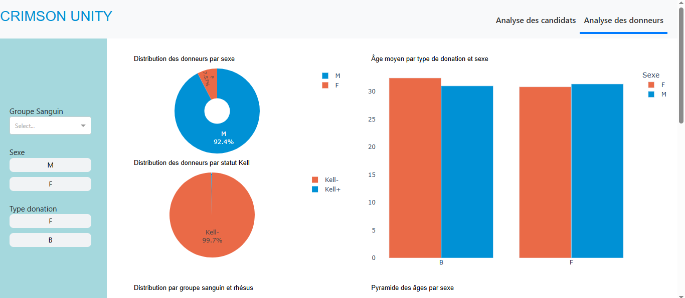

# Crimson Unity - Blood Donation Eligibility Analysis

## Project Description
Crimson Unity is a data analysis application that evaluates and visualizes blood donation eligibility criteria based on various demographic factors such as marital status, gender, education level, and donation history.

## Features
- Eligibility assessment for blood donation
- Demographic distribution analysis
- Visualization of donor eligibility statistics
- Temporary eligibility status tracking
- Candidate analysis dashboard

## acces direct sur le web
https://projet-indaba-2.onrender.com

## Apercu de l'application
Voici quelques apercus de l'application





## Installation Instructions

1. **Clone the repository**:
   ```bash
   git clone https://github.com/edy003/projet_indaba.git
   cd crimson-unity
   ```

2. **Set up a virtual environment** (recommended):
   ```bash
   python -m venv venv
   source venv/bin/activate  # On Windows use `venv\Scripts\activate`
   ```

3. **Install dependencies**:
   ```bash
   pip install -r projet_indaba/requirements.txt
   ```

4. **Run the application**:
   ```bash
   python src/indaba.py
   ```

## Usage
After launching the application, you will be presented with a dashboard showing:
- Overall eligibility percentage 
- Gender distribution of donors 
- Temporary eligibility status
- Candidate analysis charts
- Education level eligibility statistics

## Data Structure
The application processes data containing:
- Marital status
- Donation history (Yes/No)
- Gender information
- Education levels
- Eligibility flags

## Contributing
Contributions are welcome! Please fork the repository and submit a pull request with your changes.
